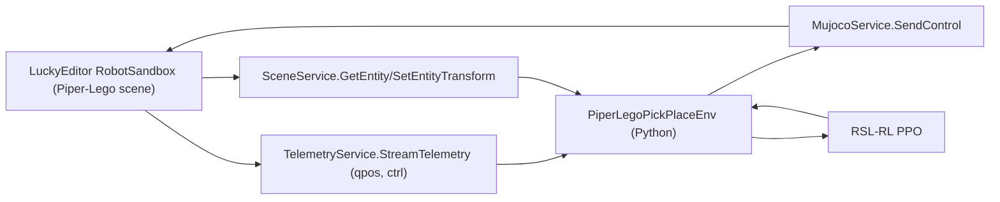

# Single-agent Piper-Lego PPO (RSL-RL)

## Goal

- Train a **single PPO policy** (RSL-RL) that controls Piper to pick **`Red Block`** and place it at **`BoxTarget`**, using **Python-computed reward/done**.
- Use the existing gRPC services exposed by LuckyEditor (`MujocoService`, `TelemetryService`, `SceneService`).

## Key constraints / reality check

- The current `AgentService` path in LuckyEditor is effectively a **fallback to Telemetry (qpos/ctrl)**, not a true bidirectional “agent env” (it does not accept per-step actions over the stream).
- Therefore the cleanest minimal demo is:
  - **Observations**: `TelemetryService.StreamTelemetry` (qpos) + `SceneService.GetEntity` (end-effector, block, target transforms)
  - **Actions**: `MujocoService.SendControl` (writes directly to `mjData::ctrl`)

## Proposed architecture

## Implementation steps (code changes)

- **Add a small Python environment** that:
  - Connects via existing `GrpcSession`.
  - Streams telemetry (qpos/ctrl) at a configured FPS.
  - Queries scene transforms by tag name each step:
    - End effector: default `link6` (fallback to `link8` if missing)
    - Block: `Red Block`
    - Target: `BoxTarget`
  - Implements `reset()` by:
    - Randomizing `Red Block` transform (x/z ranges matching `PiperLego.cs`), via `SceneService.SetEntityTransform`.
    - Sending a “home” control vector for a short settle period (and gripper open if actuator exists).
  - Implements `step(action)` by:
    - Mapping policy action (normalized [-1,1]) into a full `ctrl[0..nu)` vector using `TelemetrySchema.action_names`.
    - Sending controls via `MujocoService.SendControl`.
    - Waiting for next telemetry frame.
    - Building a **state-only observation** vector (no camera), e.g.:
      - selected joint qpos (+ finite-diff velocities)
      - end-effector position
      - block position
      - target position
      - block-to-target and ee-to-block deltas
    - Computing **reward** (shaped) and **done** (success or timeout), e.g.:
      - reach shaping: \(-\|ee-block\|\)
      - lift bonus: block.y above threshold
      - place shaping: \(-\|block-target\|\)
      - success bonus when block within radius of target and above table
      - action penalty
      - timeout done after N steps

- **Add an RSL-RL adapter** (single-env VecEnv wrapper) that exposes:
  - `num_envs = 1`, `num_obs`, `num_actions`
  - `reset()` and `step()` returning PyTorch tensors on the configured device
  - (We’ll match the exact `rsl_rl` VecEnv API during implementation; the wrapper will be minimal and purpose-built for the demo.)

- **Add a runnable training script**:
  - `examples/train_ppo_piper_lego.py`:
    - Connects to `--address` (default `127.0.0.1:50051`)
    - Verifies required entities exist (`Red Block`, `BoxTarget`, `link6`/`link8`)
    - Runs PPO training for a small number of iterations and prints episodic return/success rate.

## Files expected to change / add

- Add: [`src/luckyrobots/rl/piper_lego_env.py`](src/luckyrobots/rl/piper_lego_env.py)
- Add: [`src/luckyrobots/rl/rsl_vec_env.py`](src/luckyrobots/rl/rsl_vec_env.py)
- Add: [`examples/train_ppo_piper_lego.py`](examples/train_ppo_piper_lego.py)
- Update (optional): [`pyproject.toml`](pyproject.toml) to add an **optional extra** for RL (`rsl-rl-lib`, and whatever minimal deps are appropriate)

## How you’ll run it

- In LuckyEditor:
  - Load `Piper-Lego.hscene`
  - Start gRPC server with **Scene + MuJoCo + Telemetry** enabled (port `50051`)
- In Python:
  - Install RL deps (exact command depends on how you manage torch; we’ll keep it minimal)
  - Run `python examples/train_ppo_piper_lego.py --address 127.0.0.1:50051`

## Success criteria for the demo

- Script connects, streams telemetry, can move joints via `SendControl`.
- Reward/done executes every step and episodes reset by teleporting the `Red Block`.
- PPO loop runs and produces non-NaN losses/returns; basic learning signal visible (even if not fully converged).